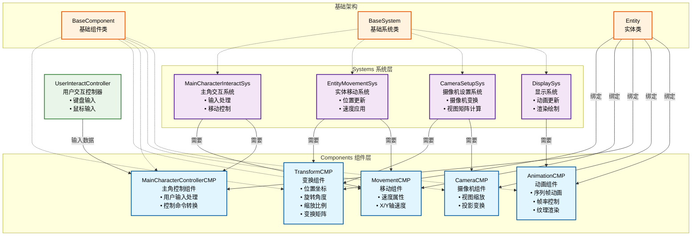
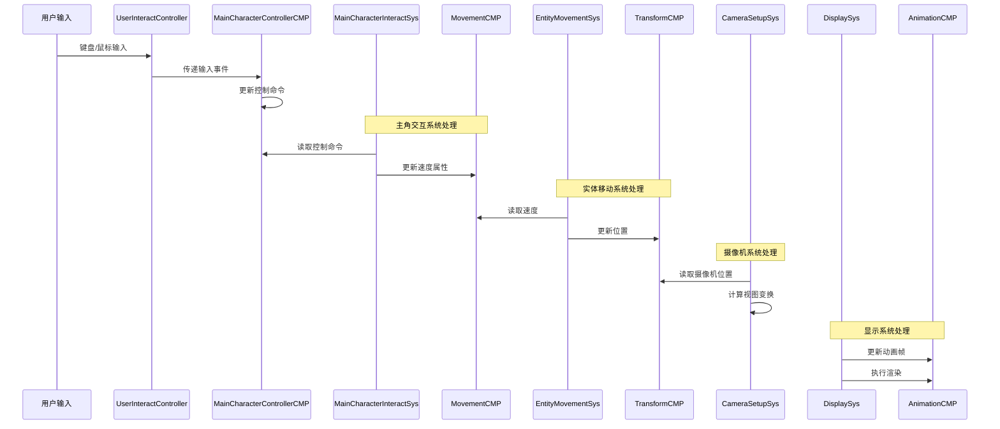

# Love2D 游戏 ECS 架构关系图

## Component-System 关系图

## 系统工作流程

## 关键特性

### 1. ECS 架构模式
- **Entity**: 游戏对象的容器，可绑定多个组件
- **Component**: 纯数据结构，存储游戏对象的属性
- **System**: 处理逻辑，操作具有特定组件组合的实体

### 2. 组件职责分离
- **TransformCMP**: 处理所有空间变换（位置、旋转、缩放）
- **MovementCMP**: 管理移动速度
- **AnimationCMP**: 负责序列帧动画播放
- **CameraCMP**: 控制摄像机投影
- **MainCharacterControllerCMP**: 处理用户输入到游戏命令的转换

### 3. 系统依赖关系
- **DisplaySys**: 仅依赖 `AnimationCMP`
- **CameraSetupSys**: 需要 `CameraCMP` + `TransformCMP`
- **EntityMovementSys**: 需要 `MovementCMP` + `TransformCMP`
- **MainCharacterInteractSys**: 需要 `MainCharacterControllerCMP` + `MovementCMP`

### 4. 数据流向
1. 用户输入 → `UserInteractController` → `MainCharacterControllerCMP`
2. 控制命令 → `MainCharacterInteractSys` → `MovementCMP`
3. 速度数据 → `EntityMovementSys` → `TransformCMP`
4. 位置数据 → `CameraSetupSys` (摄像机跟随)
5. 动画数据 → `DisplaySys` → 屏幕渲染

这个架构设计实现了良好的模块化和可扩展性，每个组件和系统都有明确的职责，便于维护和扩展新功能。